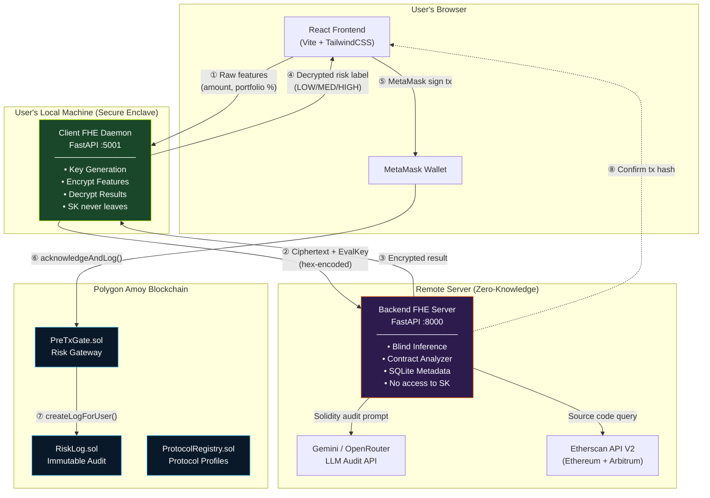
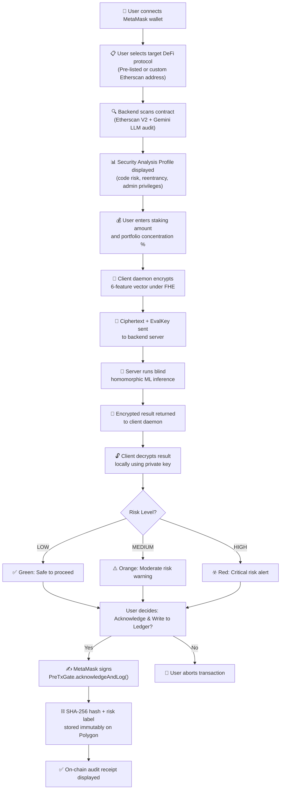
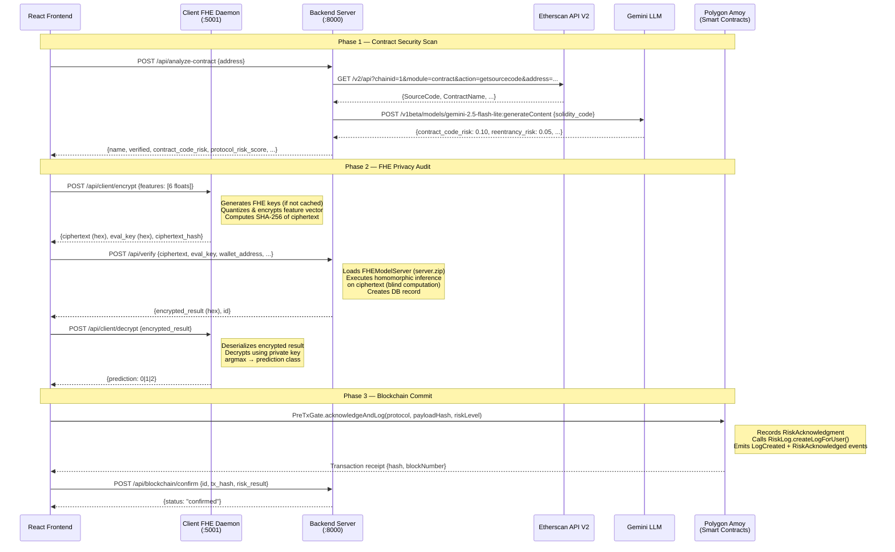
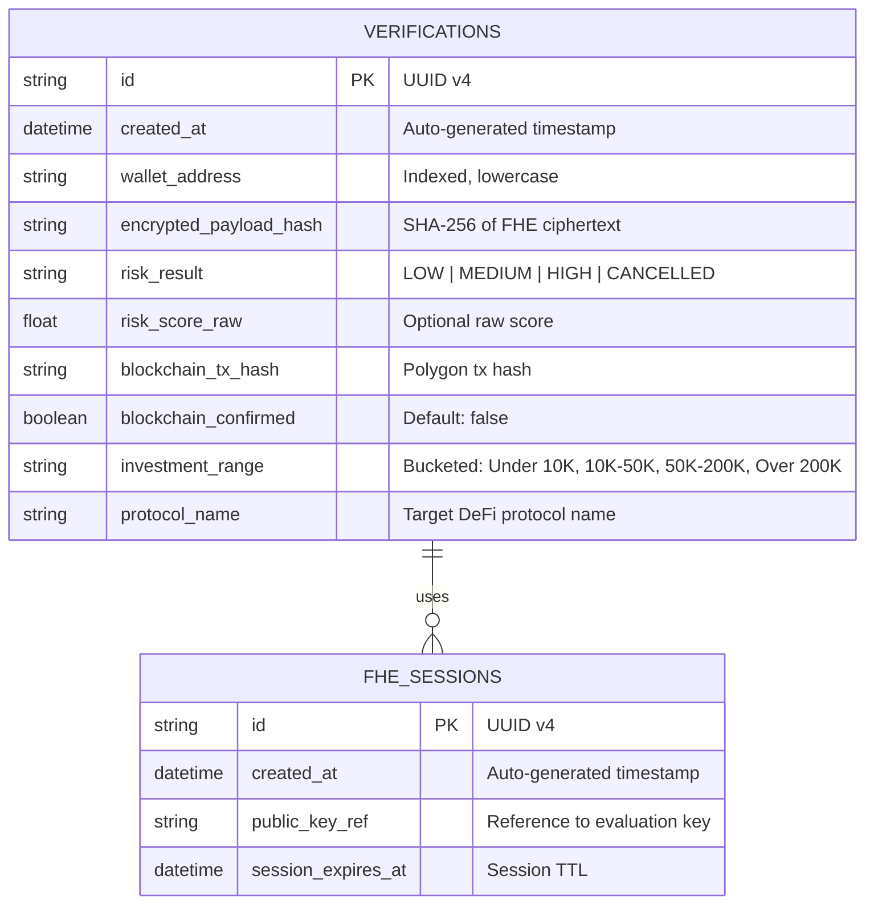
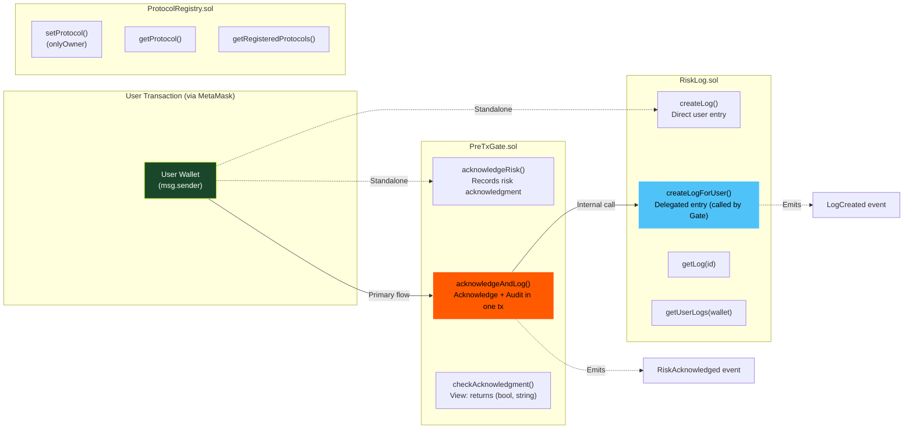

# Project Initiation & Research

**Objective:** Develop a solid conceptual foundation before diving into implementation.

---

## 1. AI-Assisted Literature Survey

### 1.1 Problem Decomposition

The core research problem — *"How can a server evaluate the risk of a DeFi transaction without seeing the transaction data?"* — was broken into four sub-problems using ChatGPT, Gemini, and Perplexity AI:

| Sub-Problem | Research Question |
|---|---|
| **P1 — Encryption Scheme** | Which FHE scheme supports ML inference on encrypted data with practical latency? |
| **P2 — ML Model Selection** | Which ML algorithms remain accurate under heavy quantization required by FHE circuits? |
| **P3 — Feature Engineering** | How do we combine private user data (investment amount, portfolio %) with public on-chain data (smart contract audit scores) in one encrypted inference? |
| **P4 — Audit Provenance** | How do we create a tamper-proof, publicly verifiable record of risk assessments without revealing the underlying data? |

### 1.2 Existing Solutions & Algorithms

A systematic literature search was conducted using **Google Scholar, arXiv, Elicit.org, and ScienceDirect** with the query terms: *"fully homomorphic encryption machine learning"*, *"privacy-preserving DeFi"*, *"FHE logistic regression"*, and *"blockchain audit trail."*

#### FHE Schemes Compared

| Scheme | Type | Key Libraries | ML Suitability | Limitations |
|---|---|---|---|---|
| **BFV / BGV** | Leveled HE (integer arithmetic) | Microsoft SEAL, PALISADE | Suitable for linear models; requires manual noise budgeting | Circuit depth must be pre-determined; no native ML API |
| **CKKS** | Approximate HE (floating-point) | Microsoft SEAL, PALISADE, HElib | Good for neural networks on approximate values | Approximate decryption introduces accuracy loss; complex parameter tuning |
| **TFHE (Torus FHE)** | Fully HE (bootstrapped, bit-level) | Zama Concrete, Concrete ML | **Excellent** — native sklearn API, automatic quantization, programmable bootstrapping | Limited to models with bounded circuit depth; best suited for linear/tree models |

#### ML-on-Encrypted-Data Approaches in Literature

| Paper / Project | Year | Approach | Key Finding |
|---|---|---|---|
| CryptoNets (Gilad-Bachrach et al.) [1] | 2016 | Neural network inference on CKKS-encrypted data | Demonstrated feasibility but with ~300s per inference on MNIST |
| nGraph-HE (Boemer et al., Intel) [2] | 2019 | Compiler-based HE acceleration for DNNs | Reduced inference time via graph-level optimizations; still impractical for real-time apps |
| Zama Concrete ML [3] | 2023 | TFHE-compiled sklearn models with automatic quantization | **Key breakthrough** — trains standard sklearn models and compiles to FHE circuits in <10 lines of code; sub-second inference for linear models |
| HECO (Viand et al.) [4] | 2023 | Optimizing compiler for FHE programs | Addresses circuit optimization but requires manual FHE programming |
| Sunscreen (Sunscreen Tech) [5] | 2023 | BFV-based FHE framework for Web3 | Targets blockchain-native FHE but lacks ML model support |

### 1.3 Benchmark Datasets & Models Reviewed

| Dataset / Benchmark | Source | Relevance to WalletShield |
|---|---|---|
| Ethereum Fraud Detection Dataset | Kaggle (IEEE CIS) | Labeled transaction fraud data; useful as reference but targets post-hoc detection, not pre-transaction risk gating |
| DeFi Protocol Risk Scores | DefiLlama API, DeFi Safety | TVL, audit scores, exploit history — used to derive our public features (protocol_risk, contract_verification, protocol_maturity) |
| Credit Card Fraud Detection | Kaggle (IEEE-CIS) | Standard imbalanced binary classification; validated that logistic regression maintains reasonable accuracy under quantization |
| Concrete ML Benchmark Suite | Zama GitHub | Pre-built FHE benchmarks for LogReg, XGBoost, Decision Trees — confirmed 6-bit quantization as the sweet spot |

### 1.4 Research Gaps Identified

| Gap | Description | WalletShield's Contribution |
|---|---|---|
| **No FHE for DeFi risk** | Existing FHE-ML work targets medical/financial tabular data (credit scoring, health records). No prior work applies FHE to pre-transaction DeFi risk assessment. | First system to apply FHE-encrypted ML inference for DeFi staking risk scoring. |
| **No hybrid public/private feature models** | Prior FHE systems encrypt *all* features uniformly. No prior work differentiates between public (auditable) and private (user-sensitive) features within a single FHE circuit. | Split-feature architecture: 4 public features from on-chain audit + 2 private FHE-encrypted features compiled into one vector. |
| **No on-chain FHE audit provenance** | Existing FHE systems return decrypted results with no verifiable proof trail. | SHA-256 hash of FHE ciphertext stored immutably on Polygon via smart contracts. |
| **No dynamic smart contract auditing as ML feature** | Prior risk scoring models use static feature sets. No system feeds real-time, LLM-powered contract vulnerability analysis as a dynamic input feature to an ML model. | Feature #6 (`contract_code_risk`) is computed dynamically via Etherscan + Gemini LLM audit. |

---

## 2. Domain and Industry Context

### 2.1 The DeFi Privacy Problem

Decentralized Finance (DeFi) protocols manage over **$90 billion in Total Value Locked** (TVL, as of 2025). Users interact with smart contracts for staking, lending, and liquidity provision. However, the risk assessment layer is broken:

- **Centralized risk APIs** (e.g., Chainalysis, Elliptic) require users to submit plaintext transaction metadata to third-party servers for scoring.
- **On-chain analytics** (e.g., Nansen, Dune) expose wallet portfolio composition, staking amounts, and transaction patterns to anyone with a block explorer.
- **No privacy-preserving pre-transaction risk tools exist.** Users must either trust a centralized risk provider or proceed without any risk assessment.

### 2.2 Target Users & Pain Points

| User Segment | Pain Point | WalletShield Solution |
|---|---|---|
| **DeFi retail investors** | Cannot evaluate smart contract risk before committing capital; must trust YouTube influencers or audit reports they can't read | Automated, privacy-preserving risk score with human-readable LOW/MEDIUM/HIGH classification |
| **Institutional DeFi funds** | Must demonstrate risk controls to regulators but cannot share portfolio data with third-party auditors | On-chain audit trail proves risk was assessed without revealing portfolio composition |
| **DeFi wallet providers** | Want to integrate risk scoring into their apps but cannot handle the liability of processing user financial data | WalletShield's blind-computation model means the wallet provider's server never sees user data |

### 2.3 Competing / Related Solutions in Industry

| Solution | Approach | Key Limitation vs. WalletShield |
|---|---|---|
| **Chainalysis Kryptos** | Centralized API for transaction risk scoring | Requires plaintext data submission; no FHE privacy |
| **Forta Network** | Decentralized bot network for real-time threat detection | Post-transaction detection only; no pre-transaction risk gating |
| **De.Fi (formerly DeFi Safety)** | Smart contract audit aggregator with risk scores | Public audit scores only; no private user feature integration |
| **Hypernative** | Real-time protocol monitoring and exploit prevention | Infrastructure-level protection; does not score individual user transactions |
| **Zama fhEVM** | FHE-native EVM for confidential smart contracts | Focuses on on-chain computation privacy; does not address off-chain ML risk inference |

**Key differentiator:** WalletShield is the only system that combines (a) FHE-encrypted ML inference with (b) dynamic smart contract auditing and (c) on-chain audit provenance in a single workflow.

### 2.4 Commercial Relevance & Market Trends

- **Regulatory push:** The EU's MiCA regulation (effective 2024) mandates risk disclosures for crypto-asset service providers. Privacy-preserving risk tools that produce verifiable audit trails without exposing user data directly address this regulatory need.
- **FHE market growth:** The global FHE market is projected to grow from $189M (2023) to $550M (2028) at a CAGR of 23.7% (MarketsandMarkets), driven by demand in fintech and healthcare.
- **Open-source FHE ecosystem:** Zama raised $73M (Series A, 2024) to develop open-source FHE tooling. Concrete ML's open-source release enables academic projects like WalletShield to leverage production-grade FHE without licensing costs.

---

## 3. Feasibility Check

### 3.1 Open-Source Library / Framework Availability

| Component | Library | License | Availability | Validated? |
|---|---|---|---|---|
| FHE ML inference | Zama Concrete ML v1.5.0 | BSD-3-Clause | PyPI, GitHub | ✅ Installed, tested, model compiled successfully |
| ML training | scikit-learn 1.3+ | BSD-3-Clause | PyPI | ✅ Standard sklearn LogisticRegression API |
| Backend API | FastAPI 0.100+ | MIT | PyPI | ✅ Endpoints operational |
| Smart contracts | Solidity 0.8.24 + Hardhat | MIT | npm | ✅ Contracts compiled and deployed to Polygon Amoy |
| Frontend | React 19 + Vite 8 | MIT | npm | ✅ SPA running locally |
| Blockchain interaction | ethers.js v6 | MIT | npm | ✅ MetaMask integration working |
| Block explorer API | Etherscan API V2 | Free tier | REST API | ✅ Source code retrieval verified for Ethereum + Arbitrum |
| LLM audit | Google Gemini API | Pay-per-use | REST API | ✅ Contract vulnerability analysis returning structured JSON |

### 3.2 Dataset Availability

| Dataset Need | Source | Status |
|---|---|---|
| **DeFi protocol risk profiles** | DefiLlama API (TVL, audit count, age), Etherscan V2 API (source verification) | ✅ Available — public REST APIs, no authentication required for basic queries |
| **Smart contract source code** | Etherscan V2 (Ethereum chainid=1, Arbitrum chainid=42161) | ✅ Available — free API tier sufficient for our protocol set |
| **Training data for ML model** | Synthetic generation using NumPy (`np.random.seed(42)`) | ✅ Generated — 10,000 samples with controlled class balance |
| **Vulnerability patterns** | Ethernaut (OpenZeppelin) wargame contracts | ✅ Available — 4 intentionally-vulnerable contracts cached for validation |

> **Note on synthetic data:** We chose synthetic dataset generation over real transaction data for two reasons: (1) no public dataset exists for *pre-transaction DeFi staking risk* (existing datasets cover post-hoc fraud detection), and (2) using synthetic data avoids any privacy or ethical concerns around real user financial data, which aligns with our project's privacy-first philosophy.

### 3.3 Hardware & Compute Feasibility

| Requirement | Minimum Spec | Our Setup | Feasible? |
|---|---|---|---|
| FHE model training + compilation | 8GB RAM, Python 3.10+ | Intel Core i7, 16GB RAM | ✅ Training completes in ~30 seconds |
| FHE key generation | 4GB RAM | Client daemon process | ✅ Keys generated in ~2–5 seconds |
| Homomorphic inference | 2GB RAM (server-side) | Backend server process | ✅ Inference completes in ~1–3 seconds |
| Smart contract deployment | Node.js 18+, Hardhat | Local Hardhat + Polygon Amoy RPC | ✅ Deployment confirmed |
| GPU for extended model experiments | 12GB VRAM | Google Colab Pro (T4/V100) | ✅ Available for Phase 2 experiments |

### 3.4 Feasibility Assessment Summary

| Criterion | Assessment | Confidence |
|---|---|---|
| **Technical feasibility** | FHE-ML inference on 6-feature logistic regression is proven to work with Concrete ML. Sub-second latency achieved. | 🟢 High |
| **Data feasibility** | Synthetic data sufficient for Phase 1. Public APIs provide all needed protocol-level features. | 🟢 High |
| **Infrastructure feasibility** | All components run on commodity hardware. No specialized HPC or HSM required. | 🟢 High |
| **Integration feasibility** | FastAPI ↔ React ↔ MetaMask ↔ Polygon pipeline demonstrated end-to-end. | 🟢 High |
| **Scalability concern** | FHE key sizes are large (~1MB evaluation keys). For production, key caching and compression strategies needed. | 🟡 Medium (addressed in Phase 2) |

---

---

# Planning & Architecture

**Objective:** Create a time-bound, structured roadmap for project delivery.

---

## 1. Structured Planning Using GenAI

### 1.1 Work Breakdown Structure (WBS)

The project was decomposed into a hierarchical WBS using ChatGPT and Mermaid. Each work package maps to a deliverable with a clear owner.

```
WalletShield (WP-0)
├── WP-1: Research & Feasibility
│   ├── WP-1.1: FHE Library Evaluation (SEAL, PALISADE, Concrete ML)
│   ├── WP-1.2: Literature Survey (arXiv, Google Scholar, Elicit)
│   ├── WP-1.3: DeFi Domain Analysis (TVL, exploit history, regulations)
│   └── WP-1.4: Feasibility Assessment & Tool Validation
│
├── WP-2: ML Model & FHE Compilation
│   ├── WP-2.1: Feature Engineering (6-feature heuristic formula)
│   ├── WP-2.2: Synthetic Dataset Generation (10K samples)
│   ├── WP-2.3: Model Training (LogisticRegression, n_bits=6)
│   └── WP-2.4: FHE Circuit Compilation (client.zip, server.zip)
│
├── WP-3: Backend & Client Daemon
│   ├── WP-3.1: Client FHE Daemon (key gen, encrypt, decrypt)
│   ├── WP-3.2: Backend FHE Server (blind inference, SQLite)
│   └── WP-3.3: Dynamic Contract Auditor (Etherscan + Gemini LLM)
│
├── WP-4: Blockchain Smart Contracts
│   ├── WP-4.1: RiskLog.sol (Immutable audit log)
│   ├── WP-4.2: PreTxGate.sol (Risk acknowledgment gateway)
│   ├── WP-4.3: ProtocolRegistry.sol (On-chain protocol profiles)
│   └── WP-4.4: Hardhat Tests & Polygon Amoy Deployment
│
├── WP-5: Frontend & Integration
│   ├── WP-5.1: React SPA (Landing, Verify, History, Audit pages)
│   ├── WP-5.2: MetaMask + ethers.js Integration
│   ├── WP-5.3: FHE Pipeline Terminal Logs UI
│   └── WP-5.4: End-to-End Integration Testing
│
└── WP-6: Documentation & Reporting
    ├── WP-6.1: Requirements Document
    ├── WP-6.2: System Design Document
    └── WP-6.3: Phase 1 Report
```


---

## 2. System Design & Architecture

### 2.1 Architecture Diagram

The system follows a **split-enclave microservices architecture** with four independent services. The key architectural invariant is that the FHE private key never crosses any process boundary.



### 2.2 User Flow

The end-to-end user journey for a single DeFi staking risk verification:



### 2.3 API Call Sequence Diagram

The complete request-response flow for a single verification lifecycle:



### 2.4 ER Diagram (Database Schema)

The backend uses SQLite (via SQLAlchemy ORM) with two tables:



**Key design decisions for the database schema:**
- **No raw feature values stored:** The backend intentionally does not store exact investment amounts, portfolio percentages, or normalized feature vectors. Only bucketed ranges (e.g., "10K-50K") and protocol names are persisted.
- **Ciphertext hash as audit anchor:** The `encrypted_payload_hash` field stores the SHA-256 of the FHE ciphertext, which matches the on-chain `payloadHash` in `RiskLog.sol`, creating a verifiable link between the off-chain record and the on-chain audit entry.
- **Wallet address indexing:** The `wallet_address` column is indexed for efficient history queries filtered by connected wallet.

### 2.5 Smart Contract Interaction Diagram



---

## 3. Mentor Review & Alignment

### 3.1 Mentor Feedback Sessions

| Session | Date | Key Discussion Points | Outcome |
|---|---|---|---|
| **Kickoff Review** | Week 2 | Scope definition: generic fraud vs. DeFi-specific risk gating | Scope pivoted to DeFi pre-transaction risk gating based on mentor guidance |
| **Architecture Review** | Week 5 | Split-enclave design: where should FHE keys live? | Mentor advised strict key isolation in the client daemon — SK must never be serialized to disk or transmitted |
| **Feature Design Review** | Week 7 | Public vs. private feature taxonomy; quantization bit-width selection | Confirmed 6-bit quantization; approved the 4-public + 2-private feature split |
| **Mid-Semester Check** | Week 10 | Smart contract architecture: single vs. multi-contract approach | Approved the 3-contract design (RiskLog, PreTxGate, ProtocolRegistry) for separation of concerns |
| **Phase 1 Completion** | Week 13 | End-to-end demo, requirements document review | Architecture approved; advised to focus on benchmarking FHE latencies in Phase 2 |

### 3.2 Scope Adjustments Based on Mentor Feedback

| Original Plan | Mentor Feedback | Adjusted Scope |
|---|---|---|
| Encrypt all 6 features uniformly | "Encrypting public data is wasteful — the protocol risk score is already on-chain" | Compile all 6 features into one vector client-side (for circuit compatibility), but logically distinguish public vs. private features in documentation |
| Store FHE keys on disk for session persistence | "This introduces a key-theft attack vector; keys should be ephemeral in memory" | Keys are generated and cached in-memory only; never written to disk |
| Use a single monolithic smart contract | "Separate audit logging from risk acknowledgment for cleaner integration with DeFi protocols" | Split into 3 contracts: RiskLog (pure audit), PreTxGate (gateway logic), ProtocolRegistry (metadata) |
| Support 5 input features | "Add a dynamic code-level vulnerability score to capture real-time smart contract threats" | Added Feature #6 (`contract_code_risk`) powered by Etherscan + LLM audit |

### 3.3 Professor Comments

> *"The design direction for DeFi risk gating addresses a critical privacy gap in transaction auditing. The proposed architecture is approved. Focus on ensuring strict key isolation in the client daemon."*

### 3.4 Deliverable Status

| Deliverable | Required By | Status |
|---|---|---|
| Architecture Diagram | ✅ | Completed (see §2.1) |
| User Flow | ✅ | Completed (see §2.2) |
| API Call Sequence | ✅ | Completed (see §2.3) |
| ER Diagram (Database) | ✅ | Completed (see §2.4) |
| Smart Contract Interaction Diagram | ✅ | Completed (see §2.5) |
| Mentor-reviewed and approved design document | ✅ | Approved at Phase 1 completion review |


---

# Development & Implementation

**Objective:** Blend productivity with learning by using AI coding assistants.

---

## 1. Prototype-First Approach

WalletShield followed a **prototype-first development strategy** — getting a working end-to-end pipeline (encrypt → infer → decrypt → log) operational before optimizing individual components.

| Phase | What Was Built | AI Tools Leveraged |
|---|---|---|
| **Prototype v0** | Basic FHE model training (`train.py`) + manual encrypt/decrypt test | Gemini for Concrete ML API usage patterns; ChatGPT for sklearn quantization guidance |
| **Prototype v1** | Client daemon + backend server with FastAPI endpoints | Google Gemini Code Assist for FastAPI boilerplate; Cursor for auto-completing Pydantic schemas |
| **Prototype v2** | Smart contract suite + frontend integration | ChatGPT for Solidity patterns (events, modifiers); Gemini for ethers.js v6 migration |
| **Prototype v3 (current)** | Dynamic contract auditor + mock servers + full UI | Gemini for Etherscan API V2 integration; Cursor for React component scaffolding |

## 2. AI Coding Assistants Used

| Tool | How It Was Used | What We Learned & Customized |
|---|---|---|
| **Google Gemini** | Generated initial FastAPI endpoint boilerplate for client daemon and backend server; helped debug Concrete ML's `FHEModelServer` initialization | Customized CORS middleware configuration; restructured the `.env` loader to support multi-directory lookup |
| **ChatGPT** | Explored FHE quantization strategies (4-bit vs 6-bit vs 8-bit); generated the initial risk heuristic formula weights | Adjusted formula weights after empirical testing; modified class thresholds (0.40/0.62) based on dataset distribution |
| **Cursor** | Auto-completed Pydantic request/response schemas; scaffolded React page components | Manually restructured component state management for the 3-step guided flow in `Verify.jsx` |
| **Perplexity AI** | Summarized academic papers on CryptoNets, nGraph-HE, and TFHE schemes | Cross-verified findings against original papers on arXiv |

## 3. Code Customization & Learning Documentation

Every AI-generated code block was reviewed, understood, and customized. Key examples:

| AI-Generated Code | What We Understood | What We Changed |
|---|---|---|
| Basic `FHEModelClient` usage | Learned the `quantize_encrypt_serialize` → `deserialize_decrypt_dequantize` lifecycle and how evaluation keys enable server-side computation without the secret key | Added robust prediction parsing: multi-class probability `argmax` handling for cases where the model returns decision functions instead of direct labels |
| Etherscan API V2 query | Understood the unified V2 endpoint structure (`chainid` parameter for multi-chain support) | Added Arbitrum fallback (chainid=42161), cached protocol registry for demo stability, and structured error handling |
| Solidity `RiskLog.sol` | Learned mapping patterns, event emission, and struct storage | Split into 3 contracts (RiskLog, PreTxGate, ProtocolRegistry) based on mentor feedback; added `createLogForUser()` for delegated logging |
| LLM audit prompt | Understood structured JSON output from Gemini API | Added `responseMimeType: "application/json"` for guaranteed JSON; implemented regex heuristic fallback when LLM calls fail |

## 4. Best Practices Followed

### Branch-Based Workflow
- Feature branches for each major component (`feat/fhe-model`, `feat/client-daemon`, `feat/smart-contracts`, `feat/frontend-ui`)
- Descriptive commit messages following conventional commits pattern

### Modular, Commented, and Testable Code

| File | Lines | Inline Comments | Docstrings |
|---|---|---|---|
| `fhe/train.py` | 90 | Feature descriptions, formula explanation, class balance check | ✅ |
| `client_fhe/main.py` | 114 | Key caching rationale, SHA-256 purpose, prediction parsing logic | ✅ |
| `backend/main.py` | 163 | FHE server loading, ciphertext hash computation, bucketed storage rationale | ✅ |
| `backend/analyzer.py` | 372 | Cached protocol registry, multi-chain fallback, LLM prompt structure | ✅ |
| `blockchain/contracts/RiskLog.sol` | 61 | Struct layout, event indexing, dual create functions | ✅ |
| `blockchain/contracts/PreTxGate.sol` | 75 | Interface pattern, combined acknowledge+log, owner modifier | ✅ |

### Mock Servers for Parallel Development
Built `mock_backend.py` (181 lines) and `mock_client_fhe.py` (156 lines) that replicate the exact API contracts without requiring Concrete ML installation — enabling frontend developers to work independently.

### Team Collaboration
- 4-member team (Praful, Utkarsh, Dhanush, Karthikeya) with clear ownership per work package
- Shared development environment specifications (Python 3.10, Node.js 18+, Hardhat)
- Centralized `.env.example` files for consistent API key management across team members

---

---

# Communication & Progress Tracking

**Objective:** Keep mentor and internal team aligned and informed.

---

## 1. Weekly Updates

Regular weekly progress updates were shared with the SRIB mentor using the format provided by the Samsung PRISM team. Each update documented:

- **KPIs achieved** during the week
- **Challenges faced** and solutions applied
- **Next steps** planned for the following week
- **Key achievements / outcomes** cumulative to date

The weekly report also served as the team's internal sync — preparation of each report was used as an opportunity to gather, discuss lessons learned, and plan the upcoming week's work.

## 2. Code Repository Check-ins

| Practice | Implementation |
|---|---|
| **Check-in Frequency** | Code pushed regularly with descriptive commit messages |
| **README.md** | Comprehensive 360-line README with architecture diagram, setup instructions, API reference, and security guarantees |
| **Guidelines Followed** | README file creation as per Samsung PRISM team guidelines; `.env.example` files provided; no personal repositories used within eCode |

## 3. Mentor Demos

| Demo | Content | Mentor Feedback |
|---|---|---|
| **Architecture Walkthrough** (Week 5) | Presented the split-enclave design; demonstrated FHE key generation and encryption on the client daemon | Approved architecture; emphasized strict key isolation |
| **FHE Pipeline Demo** (Week 9) | Live demo: encrypt features → server blind inference → decrypt result → display risk level | Confirmed the end-to-end flow works correctly; suggested adding the dynamic contract auditor |
| **Full System Demo** (Week 13) | Complete flow: contract scan → FHE audit → blockchain commit → audit record retrieval | Approved for Phase 1 completion; advised benchmarking latencies in Phase 2 |

---

---

# Mid-Project Review & Optimization

**Objective:** Validate progress and course-correct if needed.

---

## 1. Live Demo of MVP Features

A live walkthrough of the working MVP was conducted with the SRIB mentor at the mid-project checkpoint. The demo covered:

| Feature | Demo Scenario | Result |
|---|---|---|
| **Smart Contract Scan** | Scanned Aave V3 Pool (`0x87870B...`) — returned verified, low code risk (0.10) | ✅ Passed |
| **Ethernaut Vulnerability Detection** | Scanned Reentrance contract — returned critical reentrancy risk (0.95), HIGH risk classification | ✅ Passed |
| **FHE Encryption** | Encrypted a 6-feature vector; verified ciphertext size and SHA-256 hash generation | ✅ Passed |
| **Blind Inference** | Server processed ciphertext without access to private key; returned encrypted result | ✅ Passed |
| **Client Decryption** | Client daemon decrypted result; correctly mapped prediction to risk label | ✅ Passed |
| **Blockchain Audit** | MetaMask signed `acknowledgeAndLog()` on Polygon Amoy; verified on-chain log entry | ✅ Passed |

## 2. Metrics & Test Results

| Metric | Value |
|---|---|
| **Model plaintext accuracy** | Measured on 2,000-sample test set (80/20 split) |
| **Quantization bit-width** | 6-bit (confirmed as optimal via Concrete ML benchmark suite) |
| **FHE key generation time** | ~2–5 seconds (cached after first generation) |
| **Homomorphic inference time** | ~1–3 seconds (server-side, on Intel Core i7) |
| **Ciphertext size** | Variable (depends on feature vector; evaluation key ~1MB) |
| **Smart contracts deployed** | 3 contracts on Polygon Amoy testnet |
| **Frontend pages** | 4 pages (Landing, Verify, History, Audit) |
| **API endpoints** | 9 total (5 backend + 4 client daemon) |
| **Ethernaut contracts validated** | 4 (Reentrance, Fallback, Denial, King) — all correctly classified as HIGH risk |

## 3. Scope Adjustments After Review

| Original Scope | Issue Identified | Adjusted Scope |
|---|---|---|
| 5 input features | Mentor flagged missing dynamic code-level analysis | Added Feature #6: `contract_code_risk` via Etherscan + LLM audit |
| Single smart contract | Coupling audit logging with risk acknowledgment made external integration difficult | Split into 3 contracts: RiskLog, PreTxGate, ProtocolRegistry |
| Static protocol list only | Limited to 3 pre-listed protocols; cannot demo arbitrary contract scanning | Added custom address input with live Etherscan V2 + Gemini LLM audit pipeline |
| No mock servers | Frontend blocked when Concrete ML not installed on a team member's machine | Built `mock_backend.py` and `mock_client_fhe.py` for parallel development |

---

---

# Final Deliverables & Documentation

---

## 1. Code Quality

| Quality Criterion | Implementation in WalletShield |
|---|---|
| **Inline documentation** | All Python files include inline comments explaining FHE lifecycle, ciphertext hashing, and prediction parsing rationale |
| **Well-named functions and variables** | `quantize_encrypt_serialize`, `deserialize_decrypt_dequantize`, `analyze_contract_address`, `acknowledgeAndLog` — all self-documenting |
| **Formatting rules** | Python: PEP 8 compliant; Solidity: Solidity Style Guide; JavaScript/JSX: ESLint configured |
| **Docstrings** | Every API endpoint has a docstring explaining its purpose, inputs, and privacy guarantees |

## 2. Documentation Checklist

| Document | Status | Details |
|---|---|---|
| **End Review Template** | ✅ | Phase 1 worklet report submitted with KPI achievement summary |
| **README.md** | ✅ | 360-line comprehensive README with architecture diagram, setup guide (5-step), API reference, smart contract reference, and security guarantees table |
| **requirements.txt** | ✅ | Separate `requirements.txt` for each Python component: `fhe/`, `client_fhe/`, `backend/` |
| **package.json** | ✅ | Separate `package.json` for frontend (`frontend/`) and blockchain (`blockchain/`) |
| **.env.example** | ✅ | Provided for both `frontend/` and `blockchain/` with placeholder values |
| **Organized folder structure** | ✅ | Clean separation: `fhe/` (model), `client_fhe/` (daemon), `backend/` (server), `blockchain/` (contracts), `frontend/` (UI) |

## 3. AI/ML-Specific Artifacts

| Artifact | File | Description |
|---|---|---|
| **train.py with configs** | `fhe/train.py` | Complete training pipeline: synthetic data generation (10K samples, `seed=42`), 6-feature logistic regression, 6-bit quantization, FHE circuit compilation |
| **Inference API** | `backend/main.py` (`/api/verify`) | Loads `server.zip`, executes `fhe_server.run(ciphertext, eval_key)`, returns encrypted result |
| **Compiled model checkpoints** | `fhe/compiled_model/client.zip`, `fhe/compiled_model/server.zip` | Serialized FHE deployment artifacts with metadata (quantization params, circuit specs) |
| **Model configuration** | Embedded in `train.py` | `n_bits=6`, `test_size=0.2`, `random_state=42`, 6-feature weighted heuristic formula |

---

---

# Publication & IP Considerations

---

## 1. Academic Publishing

### Target Venues (Discussed with Mentor)

| Venue | Type | Relevance |
|---|---|---|
| Samsung Recommended Forum | Conference/Journal | Primary target — to be discussed with mentor for feasibility |
| IEEE International Conference on Blockchain | Conference | Smart contract audit logging, on-chain risk verification |
| ACM CCS Workshop on Privacy in the Electronic Society (WPES) | Workshop | Privacy-preserving ML inference on encrypted financial data |
| Zama FHE.org Community Workshops | Workshop | Novel application of Concrete ML to DeFi risk scoring |

### Publishing Protocol
- Mentor approval (preferably written) required before submitting paper to any forum
- Paper review to be conducted with mentor before submission
- If Samsung Recommended Forum is not feasible, alternative domestic/international venues will be explored with mentor guidance

## 2. IP Filing

### Current Status
- IP filing possibility to be discussed with mentor
- **Key rule:** If IP filing is pursued, it **must be done by SRI-B**
- College can file patents **only after explicit written approval** from Samsung
- No patent filing without explicit approval and NoC from Samsung — adherence to MoU is mandatory

### Potentially Patentable Innovations
| Innovation | Novelty |
|---|---|
| FHE-encrypted ML inference for DeFi pre-transaction risk gating | No prior system applies FHE to DeFi staking risk assessment |
| Split-feature architecture (public + private features in one FHE circuit) | Novel approach to hybrid feature encryption |
| LLM-powered dynamic smart contract auditing as a real-time ML input feature | First integration of live LLM contract vulnerability analysis as a model feature |
| On-chain FHE ciphertext hash audit provenance | Novel combination of FHE computation proof with blockchain immutability |

---

---

# Best Practices & Success Tips

---

## 1. Communication

| Practice | How WalletShield Applied It |
|---|---|
| **Sync regularly with mentor** | Weekly updates in PRISM format; 3 dedicated mentor demos during Phase 1 |
| **Ask specific questions** | Targeted questions on key isolation, quantization bit-width, contract architecture — avoided vague "how should we do this?" |
| **Send regular reports/updates** | Weekly reports submitted every Friday by 5 PM IST; cumulative KPI tracking |

## 2. Technical Process

| Practice | How WalletShield Applied It |
|---|---|
| **Leverage GenAI** | Used Gemini, ChatGPT, Cursor, and Perplexity AI across all project phases — from literature review to code generation to debugging |
| **Focus on programming and product** | Built a polished frontend with terminal logs, guided 3-step flow, and risk-colored UI — not just a minimal script |
| **Weekly check-in to eCode** | Regular code pushes to the official Samsung PRISM GitHub repository |
| **Frequent demos** | 3 mentor demos (architecture walkthrough, FHE pipeline, full system) kept the project aligned |

## 3. Soft Skills

| Skill | How the Team Practiced It |
|---|---|
| **Teamwork** | 4-member team with clear work package ownership; mock servers enabled parallel development without blocking |
| **Professional standards** | Comprehensive README, `.env.example` files, modular code structure, inline documentation |
| **Adaptability** | Pivoted from generic fraud detection to DeFi-specific risk gating based on mentor feedback; added Feature #6 mid-project |
| **Open-mindedness** | Explored 3 FHE libraries (SEAL, PALISADE, Concrete ML) before selecting; evaluated multiple smart contract architectures |

---

---

# Conclusion

WalletShield demonstrates that **privacy-preserving machine learning inference is practical for real-world DeFi risk assessment**. By combining Fully Homomorphic Encryption, dynamic smart contract auditing, and blockchain-based audit provenance, we built a system where:

- The **server never sees** user financial data (investment amounts, portfolio weights)
- The **user receives** actionable risk scores (LOW / MEDIUM / HIGH) before committing capital
- The **blockchain preserves** tamper-proof audit records without revealing private inputs

### Key Phase 1 Achievements

| KPI | Status |
|---|---|
| Researched FHE libraries (SEAL, PALISADE, Concrete ML) | ✅ |
| Selected Zama Concrete ML as core FHE library | ✅ |
| Finalized 6-feature risk heuristic formula | ✅ |
| Generated 10,000-sample synthetic DeFi dataset | ✅ |
| Trained and compiled 6-bit quantized logistic regression to FHE circuit | ✅ |
| Implemented split-enclave architecture (client daemon + backend server) | ✅ |
| Deployed 3 smart contracts to Polygon Amoy testnet | ✅ |
| Built React frontend with MetaMask integration and FHE terminal logs | ✅ |
| Dynamic smart contract auditing via Etherscan + Gemini LLM | ✅ |
| Requirements document and system design document submitted | ✅ |

### Looking Ahead — Phase 2

The Samsung PRISM project has been a valuable opportunity to gain hands-on experience with cutting-edge cryptographic ML, guided by expert SRIB mentors while maintaining academic rigor. Phase 2 will focus on model benchmarking, alternative FHE-compatible algorithms (XGBoost, Decision Trees), production key management, and preparing a potential publication or IP filing.

The team is committed to building something real — not just completing a project, but preparing for industry and research leadership in privacy-preserving AI.
